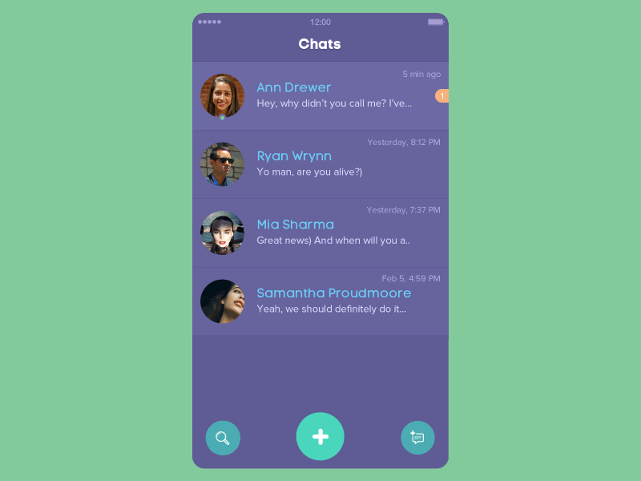

# OfficialFoldingTabBar.Android
[]()
[](https://jitpack.io/#Yalantis/OfficialFoldingTabBar.Android)
[](https://yalantis.com/?utm_source=github)

Folding Tab Bar and Tab Bar Menu


## Requirements
- Android SDK 19+

## Usage

Add to your root build.gradle:
```Groovy
allprojects {
	repositories {
	...
	maven { url "https://jitpack.io" }
	}
}
```

Add the dependency:
```Groovy
dependencies {
	compile 'com.github.Yalantis:OfficialFoldingTabBar.Android:v0.9'
}
```
## How to use this library

It’s very simple. On Android we have the @menu resource type. We can think of FoldingTabBar as a solution that provides folding menu effect. Let’s create our menu file:
```xml
<?xml version="1.0" encoding="utf-8"?>
<menu xmlns:android="http://schemas.android.com/apk/res/android">
    <item
        android:id="@+id/ftb_menu_nearby"
        android:icon="@drawable/ic_nearby_icon"
        android:title="Nearby"/>

    <item
        android:id="@+id/ftb_menu_new_chat"
        android:icon="@drawable/ic_new_chat_icon"
        android:title="Chat"/>

    <item
        android:id="@+id/ftb_menu_profile"
        android:icon="@drawable/ic_profile_icon"
        android:title="Profile"/>

    <item
        android:id="@+id/ftb_menu_settings"
        android:icon="@drawable/ic_settings_icon"
        android:title="Settings"/>

</menu>
```
Looks good. This is the menu that you’re using for dialogs, toolbar menus, or the navigation drawer. The coolest thing is that you can easily switch from the navigation drawer to our FoldingTabBar. Or you can use both menus simultaneously on the same screen; not all Android action bars have that flexibility.

 Here’s an example of how you can implement our FoldingTabBar into your layout file:
```xml
<RelativeLayout
    android:id="@+id/activity_main"
    xmlns:android="http://schemas.android.com/apk/res/android"
    xmlns:app="http://schemas.android.com/apk/res-auto"
    xmlns:tools="http://schemas.android.com/tools"
    android:layout_width="match_parent"
    android:layout_height="match_parent"
    android:background="@color/colorAccent"
    tools:context="client.yalantis.com.foldingtabbarandroid.MainActivity">

    ...

    <client.yalantis.com.foldingtabbar.FoldingTabBar
        android:id="@+id/folding_tab_bar"
        android:layout_width="wrap_content"
        android:layout_height="wrap_content"
        android:layout_alignParentBottom="true"
        android:layout_centerInParent="true"
        android:layout_marginBottom="@dimen/activity_horizontal_margin"
        app:menu="@menu/menu_tab_bar"/>

    ...
    
</RelativeLayout>
```
Initialize it in your java/kotlin code
```java
FoldingTabBar tabBar = (FoldingTabBar) findViewById(R.id.folding_tab_bar);
```

As you can see, we have some custom attributes. The main and required attribute is app:menu – here you can link your menu file to our component.
There are also some additional attributes:

*app:itemPadding* - sets padding for your menu items. Default item padding is 17dp.  
*app:mainImage* - here you can link your image resource for the main image.  
*app:selectionColor* - our menu supports color selection. You can change the menu’s color here.

Our menu is flexible, so you can use wrap_content or hard-coded sizes. When you’re using wrap_content, the size will equal 70dp.

## How to use our FoldingTabBar in Java code

Here we have two interfaces. The first works when your menu item is pressed:
```java
	tabBar.setOnFoldingItemClickListener(new FoldingTabBar.OnFoldingItemSelectedListener() {
            	@Override
            	public boolean onFoldingItemSelected(@NotNull MenuItem item) {
                	switch (item.getItemId()) {
                   	 case R.id.ftb_menu_nearby:
                        	mViewPager.setCurrentItem(0);
                        	break;
                    	case R.id.ftb_menu_new_chat:
                        	mViewPager.setCurrentItem(1);
                        	break;
                    	case R.id.ftb_menu_profile:
                        	mViewPager.setCurrentItem(2);
                        	break;
                    	case R.id.ftb_menu_settings:
                        	mViewPager.setCurrentItem(3);
                        	break;
                	}
                	return false;
            }
        });
```
The second works when a user presses the home button:
 ```java
      tabBar.setOnMainButtonClickListener(new FoldingTabBar.OnMainButtonClickedListener() {
            @Override
            public void onMainButtonClicked() {
                
            }
        });
 ```
We created two interfaces instead of one because this corresponds with the Interface Segregation principle (from SOLID).

## Technology stack
 
We chose Kotlin as the language for our library. We already have a few components in Kotlin; we love Kotlin because it’s a powerful language that makes it much more fun to develop apps than Java does. It was a good fit for Android action bar development.
    
## Collections

Here we’re using some functional “magic” of Kotlin collections:  
```kotlin
	mData = mMenu.visibleItems.map {
            initAndAddMenuItem(it)
        }
```
Also, note that we’ve used forEach instead of for loops.

## Null Safety

This fantastic feature of Kotlin is used everywhere across our library (where needed, of course). Now our code is much cleaner and more understandable.

## Lambda functions

We’ve only had this feature in Java since version 8. But Java 8 is not yet ready for Android. In Kotlin we have this feature by default.  
```kotlin
	rotationAnimator.addUpdateListener {
            valueAnimator ->
            val value = valueAnimator.animatedValue as Float
            mainImageView.rotation = value
        }
```
Really beautiful, isn’t it?

## Apply function

The apply function defines an extension function for all types. When you invoke the apply function, it calls the closure passed as a parameter and then returns the receiver object that the closure ran on. This is an amazing feature!
```kotlin
	val scalingAnimator = ValueAnimator.ofInt(mSize, destWidth).apply {
            addUpdateListener(scaleAnimator)
            addListener(rollUpListener)
        }
```

## Animations

We’re using different ValueAnimators and, of course, AnimationSets for playing our animators together. Obviously, we made our own interpolator:

```kotlin
internal class CustomBounceInterpolator(val amplitude: Double = 0.1,
                                        val frequency: Double = 0.8) : Interpolator {
 
    override fun getInterpolation(time: Float): Float {
        return (-1.0 * Math.exp(-time / amplitude) *
                Math.cos(frequency * time) + 1).toFloat()
    }
}
```
Enjoy! :)

Also check out:

Kotlin vs Java: [basic syntax differences](https://yalantis.com/blog/kotlin-vs-java-syntax/)

We constantly work on various open-source elements of navigation bar or styling tabs, and focus on providing high-quality open-source libraries for various purposes.

## Let us know!

We’d be really happy if you sent us links to your projects where you use our component. Just send an email to github@yalantis.com And do let us know if you have any questions or suggestion regarding the animation. 

P.S. We’re going to publish more awesomeness wrapped in code and a tutorial on how to make UI for iOS (Android) better than better. Stay tuned!

##License

    The MIT License (MIT)

    Copyright © 2016 Yalantis

    Permission is hereby granted, free of charge, to any person obtaining a copy
    of this software and associated documentation files (the "Software"), to deal
    in the Software without restriction, including without limitation the rights
    to use, copy, modify, merge, publish, distribute, sublicense, and/or sell
    copies of the Software, and to permit persons to whom the Software is
    furnished to do so, subject to the following conditions:

    The above copyright notice and this permission notice shall be included in
    all copies or substantial portions of the Software.

    THE SOFTWARE IS PROVIDED "AS IS", WITHOUT WARRANTY OF ANY KIND, EXPRESS OR
    IMPLIED, INCLUDING BUT NOT LIMITED TO THE WARRANTIES OF MERCHANTABILITY,
    FITNESS FOR A PARTICULAR PURPOSE AND NONINFRINGEMENT. IN NO EVENT SHALL THE
    AUTHORS OR COPYRIGHT HOLDERS BE LIABLE FOR ANY CLAIM, DAMAGES OR OTHER
    LIABILITY, WHETHER IN AN ACTION OF CONTRACT, TORT OR OTHERWISE, ARISING FROM,
    OUT OF OR IN CONNECTION WITH THE SOFTWARE OR THE USE OR OTHER DEALINGS IN
    THE SOFTWARE.
    
